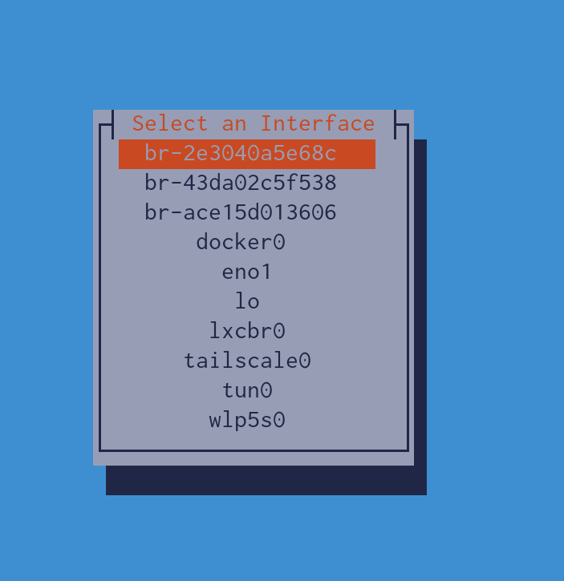
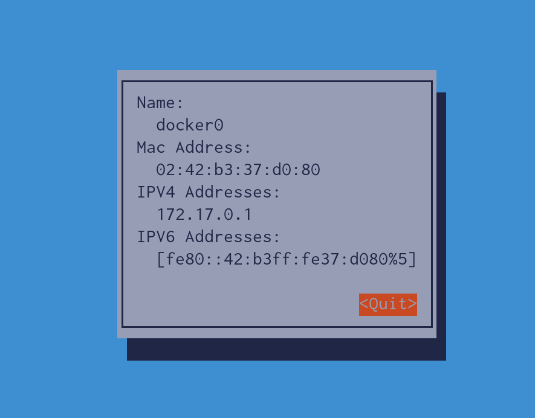

# Tyrel's Really Quick Rust TUI for IP Addresses

Standard Rust tooling - cargo run/cargo build

## TO Run

`cargo run`

Then arrow keys (or j/k) to select the interface.

Then <Enter> to see more information.

## TODO

Make things copyable. Currently `cursive` doesn't let you do that by default.
